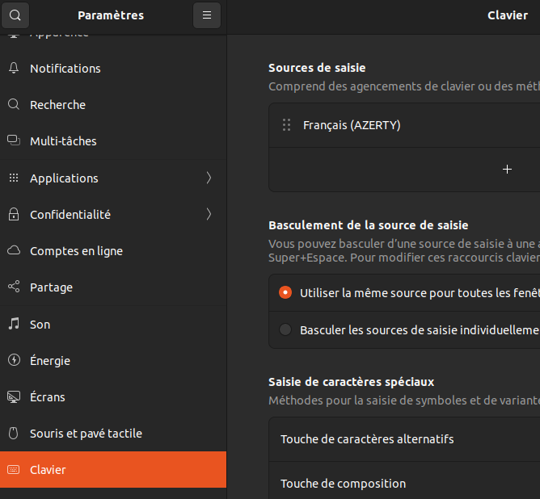
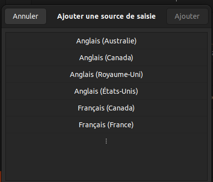
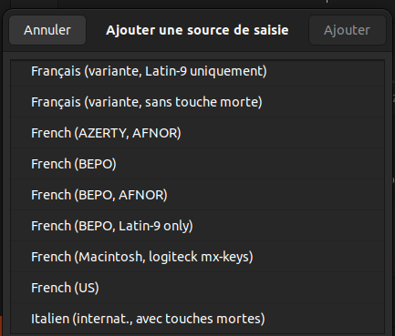
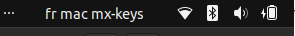

# MX-keys Mac FR sous ubuntu 22.04

Configurer un clavier Logitech MX-keys Français disposition Mac sous ubuntu 22.04

Résoudre : les touches (@,#) et (<,>) sont interverties.

## Préprequis

### Installer xmlstarlet

```shell
$ sudo apt-get install xmlstarlet
```

### Garder une copie de evdev.xml

```shell
$ sudo cp /usr/share/X11/xkb/rules/evdev.xml /usr/share/X11/xkb/rules/evdev.dist.xml
```

## Etapes

### Créer la layout modifié

Crée (owner _root_) et éditer le fichier `/usr/share/X11/xkb/symbols/macintosh_vndr/fmmxkeys`.

Contenu:

```
partial alphanumeric_keys
xkb_symbols "frmxkeys" {
  include "macintosh_vndr/fr(extended)"
  key <LSGT> { [ at, numbersign, periodcentered, Ydiaeresis ] };
  key <TLDE> { [ less, greater, lessthanequal, greaterthanequal ] };
};
```

Ce layout, nommé `frmxkeys`, est basé sur le layout `macintosh_vndr/fr(extended)` et intervertit les touches `LSGT` et `TLDE`.

### Déclaration du layout

Editer sous _root_ le fichier `evdev.xml`

```shell
$ sudo nano /usr/share/X11/xkb/rules/evdev.xml
```

Ajouter au noeud XML `LayoutList` les noeud `Layout` suivant :

```xml
<layout>
    <configItem>
      <name>macintosh_vndr/frmxkeys</name>
      <shortDescription>fr mac mx-keys</shortDescription>
      <description>French (Macintosh, logiteck mx-keys)</description>
      <languageList>
      <iso639Id>fra</iso639Id>
      </languageList>
    </configItem>
</layout>
```

### Pour finir

Aller dans mles preferences du clavier et cliquer sur le bouton '+' pour ajouter une source de saisie :



Choisir pour langue 'Français (France)' :



Choisir le nouveau layout (mx-keys) :



Enfin choisir le layout dans la barre en haut à droite :



Si le nouveau layout n'est pas présent alors fermer la session et ouvrir à nouveau.

Si besoin installer [_solaar_](https://doc.ubuntu-fr.org/solaar) permettra de customiser les touches fonctionnelles.

## Script

Les étapes une par une, effectués par le script `install.sh`.

La sauvegarde de `/usr/share/X11/xkb/rules/evdev.xml` est à faire à la main avant de lancer.

```shell
$ ./install.sh
```

## references

https://help.ubuntu.com/community/Custom%20keyboard%20layout%20definitions?action=show&redirect=Howto%3A+Custom+keyboard+layout+definitions
